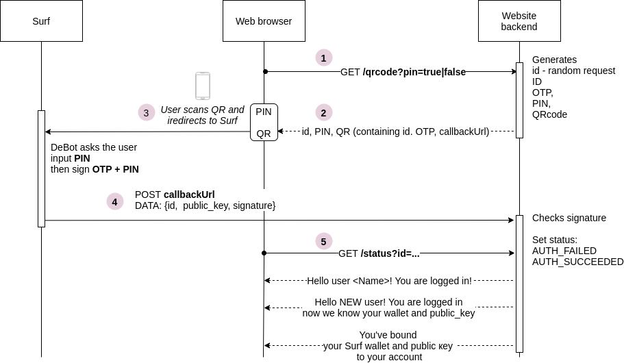

# Surf Auth DeBot

This DeBot can be used in "Sign Up" / "Sign In" flows as well as in the case when an already registered user wants to link his Surf account.

## Disclaimer
This code is still experimental, do not use it in production.

## Workflow

 - Web server generates:
   - one time password (OTP)
   - PIN (optionally)
   - callback_url
   - warning_text
   
 - Web server:
   - generates QR-code with a deeplink to the Surf containing all this data **except for the PIN**.
   - shows PIN and QR-code to the user

 - The user 
    - scans a QR code or click deeplink, and is redirected to the Surf
    - Sees warning text, e.g. "Attention! You authorize access to ABC site"
    - Enters OTP
    - Signs OTP + PIN + callback_url + warning_text, and returns his signature and **his public key** to the server

 -  If the signature is correct, the server knows that this user is the real owner of this public key.



## Prerequisites

    npm, node.js ver>=14, everdev

## The quickest start (if you want to use DeBot  already deployed in net.ton.dev)

1. Run local webserver
```
$ cd example-webserver-nodejs/
$ npm i
$ npm start
```

2.  Open http://localhost:8080/surfauth.html?pin=true in a browser 

3. Click on the link shown to open Surf on your local computer. **Do not scan** the QR code with your mobile phone, because the test web server is running on your local computer!

## If you want to deploy DeBot by yourself

1. Deploy DeBot

Set `GIVER_KEYS` and `GIVER_ADDRESS` variables in `deploy_debot.sh` file, then run:
```
$ ./compile_and_deploy.sh 
```
Remember debot_adress

2. Run local webserver
```
$ cd example-webserver-nodejs/
$ npm i
$ node src/main <debot_address>
```

3.  Open http://localhost:8080/surfauth.html?pin=true in a browser 
