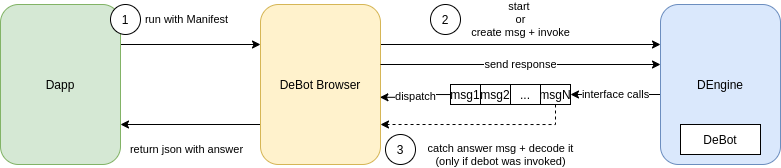

# DeBot Browser as a Service

**Status: in progress (draft)**

# Abstract

This specification describes how third-party applications can call DeBots as services in a non-interactive mode (or in semi-interactive mode) and receive responses from them. 

This allows applications to draw custom UI, collect inputs from the user and then run DeBot's certain scenario: read blockchain data, send on-chain transactions and so on - and receive answer.

# Terms

**App** - web, desktop, mobile or other application that wants to communicate with DeBots.

**DeBot Manifest -** a JSON describing how to invoke DeBot scenario and what inputs should be passed to DeBot to complete it.

**DeBot Scenario** - DeBot function that perform some logic, can call debot interfaces, require inputs and returns answer message to DeBot Browser.

## Diagram



# Specification

## Overview

DeBot Browser should support the ability to run as a standalone instance without UI components. Browser should isolate DeBot communication with the user and automatically insert necessary inputs for DeBots using **DeBot Manifest. DeBot Manifest** defines which function to call to start DeBot (by default, it is `start` function without args) and what values should be passed to DeBot on each interface call or approve request.

DeBot Browser can be started with DeBot Manifest, in that case Browser runs DeBot from `**start**` or from **defined invoking function** (with args if needed). 

If DeBot starts with `start` function which means that DeBot will run its main interactive chat-based flow, Browser should not wait for an answer from DeBot but stops working when Manifest's input chain becomes empty. *In this case we do not expect any response from the debot (i.e. we cannot treat this as the "**Get"** method).*

If Debot starts with invoking function, DeBot Browser should create and send message to DeBot on behalf of a special address and catch answer message from DeBot to this special address.

DeBot Browser's special address is **-31:0000....0000**.

DeBot Browser should decode the answer message and return it to the App.

DeBot Browser should shut down after a response (`answer`) message is received and returned to the App.

### Step by Step flow

1) Dapp constructs DeBot Manifest, starts an instance of DeBot Browser with this Manifest as a first argument (and maybe some other parameters like network).

2) DeBot Browser starts Debot with initial method: `start` or other if it is defined in Manifest.

3)  DeBot Browser dispatches messages from DeBot (or DeBots if there are invoked ones) message queue as usual except interface calls. If Manifest's `chain` is not empty then for each interface call Browser should pop one chainlink from left side of the chain, check that income interface id and method equal to chainlink's interface id and method and then return `params` from chainlink as response to interface call. `answerId` decoded from interface call message should be attached to response before sending back to DeBot.

4) When next dispatched message from message queue is a message to DeBot Browser address,  Browser should drop other messages, destroy all DEngine instances, decode message body using DeBot ABI to answer object and return it to the App.

NOTE 1: if Browser needs to dispatch the next interface call message but remaining input `chain` is empty, Browser must drop this message and clear message queue, destroy all DEngine instances and return `null` answer to the App with status `"NoMoreInputsInChain"`.

### DeBot Browser Start

```jsx
struct DebotAnswer {
		answer: object,
		status: string,
}

interface Browser {
   async function run(debotManifest: object) -> Promise<DebotAnswer>;
}

try {
	let response = await Browser.run(debotManifest);
	if (response.answer != null ) {
		...
	}
} catch (err) {
	console.log(err); // invalid Manifest, unexpected DeBot request, no more inputs in chain (and so on)
}
```

### DeBot Manifest

 Manifest is a JSON object. It can be described in TypeScript like this:

```tsx
struct DebotManifest {
	init?: {
		method: string,
		params?: any 
  },
	chain?: ChainLink[],
	quiet?: bool,
	autoApprove?: string[],
	abi?: object // 
}

struct ChainLink {
	{ 
		type: "Input",
		interface: string,
		method: string,
	  params?: object | null,
		mandatory?: bool
	} | {
		type: "approveOnChainCall",
		approve: bool,
		iflq?: number, // if less or equal
		ifeq?: number, // if equal
	} | {
    type: "SigningBox",
    handle: ...,
  },
}
```

NOTE: some fields are marked as OPTIONAL which means they can be skipped in Manifest.

`init` - OPTIONAL:

`method` - defines the name of DeBot scenario to call.  By default, it is `start`,  the main DeBot flow. 

`params` - OPTIONAL, JSON object with arguments for `method` function.

`autoApprove` - allow Browser to automatically approve selected DeBot activities. [], by default. Can be overridden with **ChainLink** of type `"ApproveOnChainCall"`, `"ApproveNetwork"` or  `"ApproveMessageLimit"`.

`quiet` - OPTIONAL, default is `false`.  By default, if there are no items in the chain and DeBot requests input, The Browser should interact with the user to get input for the DeBot. Otherwise, if `quiet` is true, The Browser cannot communicate with the user and it should throw an error in that case.

`chain` - OPTIONAL, sequence of inputs that must be passed to DeBot to complete the scenario.

`interface` - DeBot Interface ID to which the request is expected. Can be used together with a `method` to validate input value.

`method` - Interface function name to be called.

`params` - OPTIONAL, parameters for interface method. Parameters can contain placeholders in the form of ${0}, ${1} and so

`optional` - OPTIONAL, `false` by default. An optional input means that it must always be at this place in the chain of inputs. Otherwise, if another interface was requested by DeBot then this input can be skipped in the chain. 

### Publishing of DeBot Manifest

Manifest should be available in 2 major ways:

- DeBot Developer can upload Manifest template to DeBot smart contract and return in `getDebotInfo` function (as Manifest argument of `string` type).
- DeBot Developer can publish Manifest template in github repository.

### Manifest Example 1

Example for Multisig DeBot (mainnet). Address: 0:09403116d2d04f3d86ab2de138b390f6ec1b0bc02363dbf006953946e807051e.

This Manifest allows to transfer 1,5 ton from wallet 0:66e01d6df5a8d7677d9ab2daf7f258f1e2a7fe73da5320300395f99e01dc3b5f to address 0:841288ed3b55d9cdafa806807f02a0ae0c169aa5edfe88a789a6482429756a94.

```jsx
{
	// skip initMethod and initArgs, by default **start()** is used.
	chain:  [
	{ 
		// AddressInput.get
    interface: d7ed1bd8e6230871116f4522e58df0a93c5520c56f4ade23ef3d8919a984653b,
    method: "get",
    params: { value: "0:66e01d6df5a8d7677d9ab2daf7f258f1e2a7fe73da5320300395f99e01dc3b5f"}
  },
	{ 
		// Menu.select
    interface: ac1a4d3ecea232e49783df4a23a81823cdca3205dc58cd20c4db259c25605b48, 
    method: "select",
    params: { index: "0" } 
	},
	{ 
		// AddressInput.get
    interface: d7ed1bd8e6230871116f4522e58df0a93c5520c56f4ade23ef3d8919a984653b,
    method: "get",
    params: { value: "0:841288ed3b55d9cdafa806807f02a0ae0c169aa5edfe88a789a6482429756a94"}
  },
	{ 
		// ConfirmInput.get
    interface: 16653eaf34c921467120f2685d425ff963db5cbb5aa676a62a2e33bfc3f6828a, 
    method: "get",
    params: { value: "true" },
		mandatory: false
	},
  { 
		// AmountInput.get
    interface: a1d347099e29c1624c8890619daf207bde18e92df5220a54bcc6d858309ece84, 
    method: "get",
    params: { value: "1500000000" } 
	},
	{ 
		// ConfirmInput.get
    interface: 16653eaf34c921467120f2685d425ff963db5cbb5aa676a62a2e33bfc3f6828a, 
    method: "get",
    params: { value: "true" },
	},
	{ 
		// SigningBoxInput.get
    interface: c13024e101c95e71afb1f5fa6d72f633d51e721de0320d73dfd6121a54e4d40a, 
    method: "get", 
    params: { handle: 26 }
  }
 ]
}
```

### Manifest Example 2

Example for the same DeBot but now Manifest runs DeBot scenario `"invokeTransaction"`. In this case, Debot should return answer message to DeBot Browser address with return args.

```jsx

{
	init: {
		method: "invokeTransaction",
		params: {
			sender: "0:66e01d6df5a8d7677d9ab2daf7f258f1e2a7fe73da5320300395f99e01dc3b5f",
			recipient: "0:841288ed3b55d9cdafa806807f02a0ae0c169aa5edfe88a789a6482429756a94",
			amount: "1500000000",
			bounce: true,
			payload: "",
		},
	},
	chain:  [{ 
		// SigningBoxInput.get
    interface: "c13024e101c95e71afb1f5fa6d72f633d51e721de0320d73dfd6121a54e4d40a", 
    method: "get", 
		params: { handle: "$1" }
  }]
}
```

### Chain Processor Recomendations

DeBot Browser should use and implement such a component as Chain Processor. 

At start DeBot Manifest must be loaded into Chain Processor. 

Every DeBot Interface implemented in Browser should call Chain Processor to receive next chainlink from Manifest. If there is one then Processor must check that this chainlink is valid: it should compare `interface` and `method` with currently requested ones. If they are equal then Processor should return this chainlink to Browser which should use `params` value as an answer for request. Otherwise Browser should throw an error `"UnexpectedInput"`. If there is no next chainlink in ChainProcessor then it should return error `"NoMoreInputsInChain"`.

NOTE: all interfaces uses `answerId` as the first argument in request. This id should be attached to `params` returned from ChainProcessor.

### How to build DeBot Manifest for the Browser

DeBot Developer can build Manifest template manually and write examples of it.

Or Debot Browser can allow to export Manifest from history of user interaction with DeBot. 

## Known issues

At the moment this Manifest doesn't support the chain splitting, meaning that the debot flow could have several dynamic cases starting from some chainLink. Right now we try to fight it with the `mandatory` field which later should be **@deprecated**, and chain spliiting technice must be used instead, e.g. presenting several chains along the Manifest, which can be switched into seamlessly when a running debot flow.